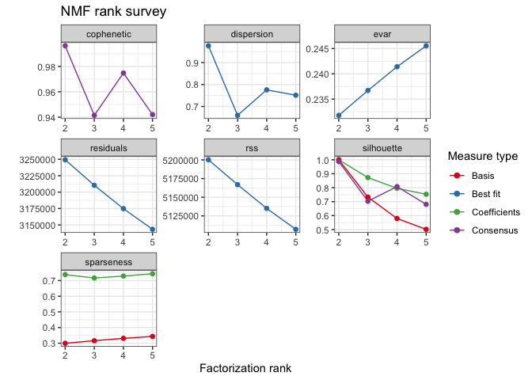
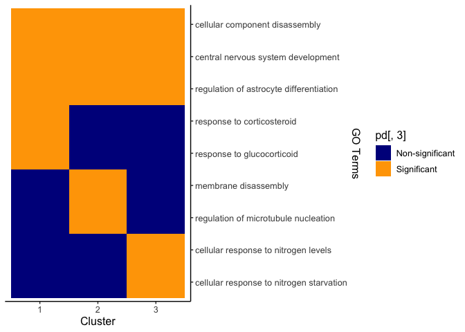

## Data Read and Quality Control

    ## [1] 17140   332

## rank selection

    muv41[muv41<0]=0.000001
    estimate = nmf(muv41, rank=2:5, method="brunet", nrun=10, seed=888)
    my_rank = rank_selection(muv41, a = 2, b = 6)

    ## Warning in .local(x, rank, method, ...): Discarding RNG specification in
    ## argument `rng`: using those passed in argument `seed`.

    my_rank

    ## function (a, b, c) 
    ## {
    ##     if (a == b) {
    ##         return(a)
    ##     }
    ##     else if (a == c) {
    ##         return(a)
    ##     }
    ##     else if (b == c) {
    ##         return(b)
    ##     }
    ##     else {
    ##         return(NULL)
    ##     }
    ##     p = equal_value(coph, disper, rss)
    ##     return(p)
    ## }
    ## <bytecode: 0x162eff730>
    ## <environment: 0x1661fc418>

    plot(estimate)

## gene metaprograms

    metaprogram = nmf_process(matrix = muv41, rank = 3, method = "brunet")
    metaprogram

    ## [[1]]
    ##  [1] "CHGB"      "TSPAN7"    "STMN2"     "NEUROD6"   "NNAT"      "STMN4"    
    ##  [7] "SH3GL2"    "ID2"       "FEZ1"      "MEG3"      "HMP19"     "KLHL13"   
    ## [13] "TMEM178A"  "TUBB2A"    "ARL6IP5"   "GABARAPL2" "ENO2"      "BEX2"     
    ## [19] "RCAN2"     "GPM6B"     "ATP6V1G2"  "GNG3"      "GALNT18"   "GSTA4"    
    ## [25] "APLP2"     "BLCAP"     "TMEM66"    "INA"       "PJA1"      "IMPDH1"   
    ## 
    ## [[2]]
    ##  [1] "STMN2"     "KCNIP4"    "CNTN2"     "ASIC1"     "NHLH1"     "CKB"      
    ##  [7] "GNG3"      "PDZRN3"    "ID2"       "BSCL2"     "TAGLN3"    "CAMK4"    
    ## [13] "CRIP2"     "NDUFB8"    "SCHIP1"    "PBX3"      "PTCHD2"    "ELAVL2"   
    ## [19] "TUBB2A"    "LINC00599" "RIMS3"     "NEFM"      "NARF"      "GNG2"     
    ## [25] "DCTN1"     "MIAT"      "PCBP4"     "NSG1"      "INA"       "MAP1LC3B" 
    ## 
    ## [[3]]
    ##  [1] "SERPINF1"   "CXCR4"      "MGP"        "PGF"        "MFAP4"     
    ##  [6] "ALDH1A3"    "HNRNPA1P10" "S100A11"    "HMGN2"      "BOC"       
    ## [11] "B2M"        "DNAJB1"     "FOS"        "DDIT4"      "NTRK3"     
    ## [16] "FAP"        "VIM"        "UQCRH"      "C6orf48"    "CCNG1"     
    ## [21] "TMEM123"    "SNHG1"      "SNRPB"      "FBL"        "TMEM98"    
    ## [26] "CCNB1IP1"   "GNG5"       "BAIAP2L2"   "SNRPD2"     "ZFP36L1"

## GO Enrichment analysis

    res1 = GOenrich(allgene = rownames(muv41), diffgene = metaprogram[[1]])

    ## 
    ## Building most specific GOs .....

    ## Loading required package: org.Hs.eg.db

    ## 

    ##  ( 11258 GO terms found. )

    ## 
    ## Build GO DAG topology ..........

    ##  ( 14896 GO terms and 33851 relations. )

    ## 
    ## Annotating nodes ...............

    ##  ( 12931 genes annotated to the GO terms. )

    ## 
    ##           -- Classic Algorithm -- 
    ## 
    ##       the algorithm is scoring 912 nontrivial nodes
    ##       parameters: 
    ##           test statistic: fisher

    res2 = GOenrich(allgene = rownames(muv41), diffgene = metaprogram[[2]])

    ## 
    ## Building most specific GOs .....

    ##  ( 11258 GO terms found. )

    ## 
    ## Build GO DAG topology ..........

    ##  ( 14896 GO terms and 33851 relations. )

    ## 
    ## Annotating nodes ...............

    ##  ( 12931 genes annotated to the GO terms. )

    ## 
    ##           -- Classic Algorithm -- 
    ## 
    ##       the algorithm is scoring 895 nontrivial nodes
    ##       parameters: 
    ##           test statistic: fisher

    res3 = GOenrich(allgene = rownames(muv41), diffgene = metaprogram[[3]])

    ## 
    ## Building most specific GOs .....

    ##  ( 11258 GO terms found. )

    ## 
    ## Build GO DAG topology ..........

    ##  ( 14896 GO terms and 33851 relations. )

    ## 
    ## Annotating nodes ...............

    ##  ( 12931 genes annotated to the GO terms. )

    ## 
    ##           -- Classic Algorithm -- 
    ## 
    ##       the algorithm is scoring 1472 nontrivial nodes
    ##       parameters: 
    ##           test statistic: fisher

    res <- list(res1,res2,res3)
    names(res) <- c(1,2,3)

    head(res1)

    ##         GO.ID                                                    Term Annotated
    ## 62 GO:0006183                                GTP biosynthetic process        10
    ## 63 GO:0006995                cellular response to nitrogen starvation        10
    ## 64 GO:0010917 negative regulation of mitochondrial membrane potential        10
    ## 65 GO:0010958  regulation of amino acid import across plasma membrane        10
    ## 66 GO:0043562                    cellular response to nitrogen levels        10
    ## 67 GO:0045837               negative regulation of membrane potential        10
    ##    Significant Expected classicFisher FDR       FC
    ## 62           1     0.02       0.02069   1 47.89259
    ## 63           1     0.02       0.02069   1 47.89259
    ## 64           1     0.02       0.02069   1 47.89259
    ## 65           1     0.02       0.02069   1 47.89259
    ## 66           1     0.02       0.02069   1 47.89259
    ## 67           1     0.02       0.02069   1 47.89259

    head(res2)

    ##          GO.ID                                     Term Annotated Significant
    ## 2   GO:0007610                                 behavior       453           6
    ## 1   GO:0007417       central nervous system development       829           8
    ## 3   GO:0048710  regulation of astrocyte differentiation        19           2
    ## 104 GO:0006995 cellular response to nitrogen starvation        10           1
    ## 105 GO:0010968     regulation of microtubule nucleation        10           1
    ## 106 GO:0030397                     membrane disassembly        10           1
    ##     Expected classicFisher    FDR        FC
    ## 2       0.95       0.00028 0.8281  6.343390
    ## 1       1.73       0.00020 0.8281  4.621722
    ## 3       0.04       0.00070 1.0000 50.413255
    ## 104     0.02       0.02069 1.0000 47.892593
    ## 105     0.02       0.02069 1.0000 47.892593
    ## 106     0.02       0.02069 1.0000 47.892593

    head(res3)

    ##        GO.ID                                     Term Annotated Significant
    ## 1 GO:0051384               response to glucocorticoid       103           5
    ## 2 GO:0031960               response to corticosteroid       113           5
    ## 3 GO:0007417       central nervous system development       829          10
    ## 4 GO:0007399               nervous system development      1944          14
    ## 5 GO:0010712 regulation of collagen metabolic process        24           3
    ## 6 GO:0009605            response to external stimulus      1783          13
    ##   Expected classicFisher         FDR        FC
    ## 1     0.22       2.5e-06 0.009858333 22.418516
    ## 2     0.24       3.9e-06 0.009858333 20.434576
    ## 3     1.80       5.0e-06 0.009858333  5.570825
    ## 4     4.21       1.4e-05 0.020702500  3.325874
    ## 5     0.05       1.8e-05 0.021294000 57.727679
    ## 6     3.86       3.1e-05 0.030560833  3.367178

## GO heatmap

    GOheatmap = plotGOEnrich (res,n = 3,fdr.cutoff = 2,fc.cutoff = 2)

    ## Using FC as value column: use value.var to override.

    ggsave("GOheatmap_muv41.png",plot =GOheatmap, height = 5,width = 6)
    GOheatmap

